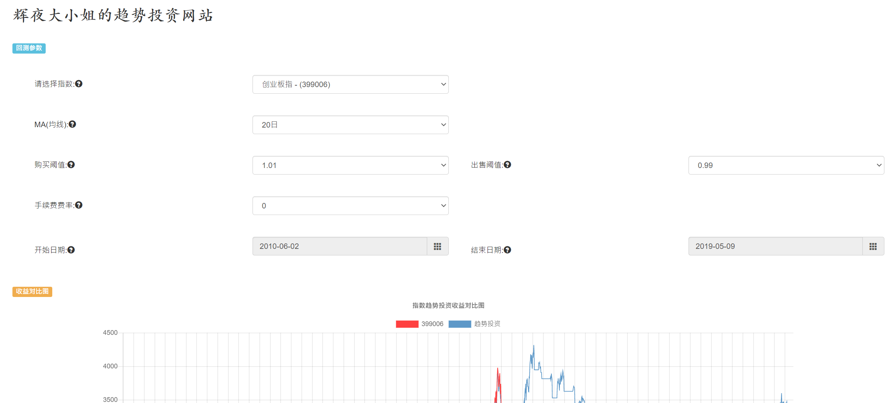
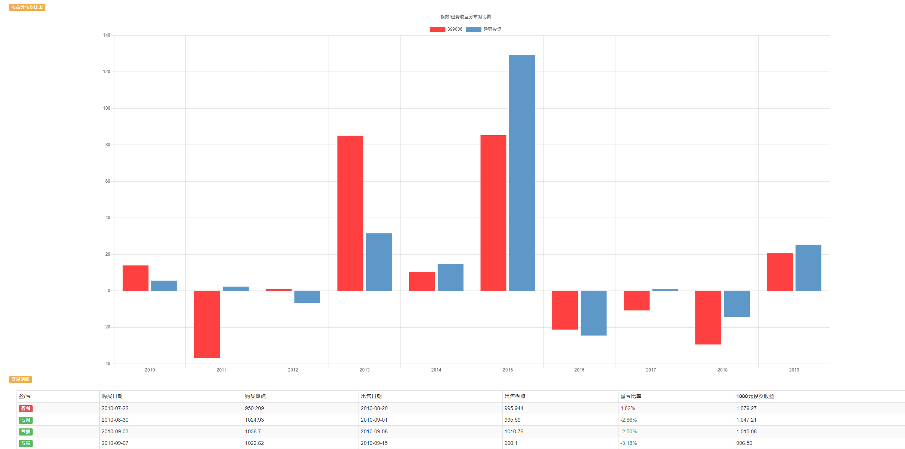

# 辉夜大小姐想让我做趋势投资模拟回测
## 项目背景
以前学习SpringCloud时仿照how2j.cn的微服务教程开发的项目，针对不同指数的收益，可以选择不同的阈值和时间区间，进行趋势投资的模拟回测。
启动后效果如图：

## 启动环境
IDEA或Eclipse，Redis服务器
（可选）RabbitMQ、zipkin

## 部署方法
启动Redis服务器，使用默认端口号6379； 
启动Eureka-server，作为微服务的注册中心； 
（可选）启动zipkin，进行服务链路追踪； 
（可选）启动RabbitMQ，使用默认端口号5672； 
（可选）启动Index-config-server，这个服务将会访问https://github.com/KaguyaShinomiya/trendConfig/blob/master/respo/trend-trading-backtest-view-dev.properties
获取版本号配置，修改了这个参数后，RabbitMQ会把消息广播给多个运行在不同端口上的视图微服务； 
启动Third-part-index-data-project，这是假装第三方数据服务的，因为真的第三方数据服务要钱； 
启动Index-gather-store-service，这是将“第三方数据服务”中的数据缓存到Redis中的； 
启动Index-codes-service和Index-data-service，这两个微服务分别负责请求所有指数的列表、以及根据指数编码获取指数详细的每日数据的； 
启动Trend-trading-backtest-service，这个服务负责在获取到的指数数据的基础上，按照前端传入的各项参数进行模拟回测，计算收益； 
启动Trend-trading-backtest-view，这个服务负责返回具体的视图；启动Trend-trading-backtest-view，这个服务负责返回具体的视图； 
启动Trend-zuul-service，即网关微服务，可以对api-view、api-code等上下文根的访问能够被路由到指定的微服务集群； 
在浏览器中访问http://127.0.0.1:8031/api-view/ 可以试着选择不同的指数，并更改趋势投资的部分参数； 
（可选）用java -jar zipkin-server-2.10.1-exec.jar --zipkin.collector.rabbitmq.addresses=localhost命令启动zipkin，
访问http://localhost:9411/zipkin/dependency/ 可以查看各个微服务之间的调用关系；  
（可选）关闭Index-gather-store-service，由于Index-service启动了断路器Hystrix，实现服务降级，所以页面并不会直接显示WhiteLabelError。 

## 跟进事项
现在再看当时做的这个练习项目还是能看到很多瑕疵，之前一直计划做一个功能更强大的量化交易网站，但是一直没有时间，就先把之前的项目上传到github上了。